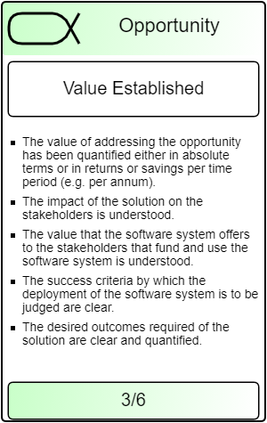

Introduction

## Purpose

This document describes the Stakeholder needs that define the opportunity for
product development of the firmware update system

## Scope

This document identifies needs of stakeholders. A need exists within the
customer/stakeholder, and will be analyzed whether there will be value generated
by addressing the Need, and pursuing the identified opportunities.

## Opportunity Identified

### The Problem

| With the success of the internet of things (IoT), the complexity of software on these devices and hence, their attack surface increases. Furthermore, the most devices are exposed to attacks through networks. Hence, more and more devices are subject to attacks (see [Ripple20](https://www.wired.com/story/ripple20-iot-vulnerabilities)). Therefore, it becomes more and more important to be able to update these devices over the air. It must be ensured that the update mechanism itself does not introduce new vulnerabilities. A remote update involves several steps, including release, deployment, installation, and attestation of the update. Furthermore, a consistent state of software through the whole installed base has to be ensured. A further complication arises from the organizational structure of typical IoT installations including multiple stakeholders: Several *original equipment manufacturers (OEMs)* that are responsible for the IoT devices. Typically they integrate subsystems from various *suppliers*. Then, the network of IoT devices is operated by an *operator* on behalf of the final *user*. |  |
|-----------------------------------------------------------------------------------------------------------------------------------------------------------------------------------------------------------------------------------------------------------------------------------------------------------------------------------------------------------------------------------------------------------------------------------------------------------------------------------------------------------------------------------------------------------------------------------------------------------------------------------------------------------------------------------------------------------------------------------------------------------------------------------------------------------------------------------------------------------------------------------------------------------------------------------------------------------------------------------------------------------------------------------------------------------------------------------------------------------------------------------------------------|-------------------------------------------------|

### Solution proposal (relation: Requirements conceived)

The task of the SCRATCh firmware update system is to deploy data on a given set
of devices. It should handle them automatically so a network of devices can be
maintained properly. The primary focus is firmware but the system can also
handle other types of data. The input of the system is a set of files and a list
of target devices. The system shall ensure that the set of files is distributed
and applied (installed) to the list of target devices. Furthermore, the system
shall provide an attestation that reports the status of the target devices after
the deployment.

Identified stakeholder needs

| **Nr** | **Description**                                                                                                                                                         | **status** |
|--------|-------------------------------------------------------------------------------------------------------------------------------------------------------------------------|------------|
| N001   | Updating a remote edge device where there is no physical access to the device                                                                                           | identified |
| N002   | Relaying a software or firmware update through the edge device to connected IoT infrastructure                                                                          | identified |
| N003   | Updates should be secure and safe.                                                                                                                                      | identified |
| N004   | In case of failure the device should automatically recover into a previous connected state                                                                              | identified |
| N005   | A notification of a successful update or updates is needed.                                                                                                             | identified |
| N006   | Alternative distribution method direct from the cloud to a IoT end device.                                                                                              | identified |
| N007   | The update system can be implemented white labeled.                                                                                                                     | identified |
| N008   | Trust relations can be resolved within a one company ownership structure.                                                                                               | identified |
| N009   | The system should also be offered to customers using a Cloud infrastructure / web interface.                                                                            | identified |
| N010   | Consider different business models, e.g. IoT infrastructure is controlled by 1 company, Iot Infrastructure is multitenant, One IoT system has different business models | identified |
| N011   | In case of a Cloud system a pay per use model should be possible                                                                                                        | identified |

### Solution Needed

A firmware update system has to cover the whole software deployment chain from
release up to installation, and attestation. Furthermore, such a system has to
technically support the organizational structures and responsibilities of IoT
supply chains. For example, one OEM is responsible for the software releases of
his device, while the operator has to maintain interoperability between releases
for different devices. A minimal system for firmware update incorporates two
major parts:

1.  The target systems that need to implement a procedure for a secure firmware
    update. Typically, this includes functions to download, install, and boot
    the firmware.
2.  The deployment infrastructure that signs, provides, and distributes firmware
    images.

The interaction of both parts is essential for the security of the system.

We design a firmware update system that addresses this problem. We apply
existing methodologies like [The update
framework](https://theupdateframework.io/) and Uptane, [@uptane_escar] to our
scenario’s.

Prerequisites

To have a working update firmware system, there must be a basic trust
infrastructure that provide IAM (Identity, Authorization, Management).

Underlying problems (including security issues)

There are multiple frameworks and also different types of bootloaders. Several
have been investigated see Collected research document EKCRFU001. Including
threats and some security requirements.

Specific security requirements can be derived from best practices of ENISA.

Concerning the mayor problems related to security: Authentication,
Identification, Confidentiality, some times collected under the term Trust, the
following ENISA requirements are relevant:

### ENISA BEST PRACTICES CYBERSECURITY

| [**Requirement Nr** ](https://trusttab.com/standards/enisa_req/list/good_practice/Trust+and+Integrity+Management?orderby=requirement_nr&ordertype=ASC) | **Description**                                                                                                                                                                                                                                       | [**Good Practice** ](https://trusttab.com/standards/enisa_req/list/good_practice/Trust+and+Integrity+Management?orderby=good_practice&ordertype=ASC) |   |
|--------------------------------------------------------------------------------------------------------------------------------------------------------|-------------------------------------------------------------------------------------------------------------------------------------------------------------------------------------------------------------------------------------------------------|------------------------------------------------------------------------------------------------------------------------------------------------------|---|
| [GP-TM-07](https://trusttab.com/standards/enisa_r_standards/view/GP-TM-07)                                                                             | Use protocols and mechanisms able to represent and manage trust and trust relationships.                                                                                                                                                              | [Trust and Integrity Management](https://trusttab.com/standards/good_practices/view/Trust+and+Integrity+Management)                                  |   |
| [GP-TM-06](https://trusttab.com/standards/enisa_r_standards/view/GP-TM-06)                                                                             | Restore Secure State - Enable a system to return to a state that is known to be secure, after a security breach occurs or if an upgrade is not successful.                                                                                            | [Trust and Integrity Management](https://trusttab.com/standards/good_practices/view/Trust+and+Integrity+Management)                                  |   |
| [GP-TM-05](https://trusttab.com/standards/enisa_r_standards/view/GP-TM-05)                                                                             | Control the installation of software on operational systems, to prevent unauthenticated software and files being loaded onto it.                                                                                                                      | [Trust and Integrity Management](https://trusttab.com/standards/good_practices/view/Trust+and+Integrity+Management)                                  |   |
| [GP-TM-04](https://trusttab.com/standards/enisa_r_standards/view/GP-TM-04)                                                                             | Sign code cryptographically to ensure it has not been tampered after being signed as safe for the device, and implement run-time protection and secure execution monitoring to be sure malicious attacks do not overwrite code after it is loaded.    | [Trust and Integrity Management](https://trusttab.com/standards/good_practices/view/Trust+and+Integrity+Management)                                  |   |
| [GP-TM-03](https://trusttab.com/standards/enisa_r_standards/view/GP-TM-03)                                                                             | The boot process initializes the main hardware components, and starts the operating system. Trust must be established in the boot environment before any trust in any other software or executable program can be claimed.                            | [Trust and Integrity Management](https://trusttab.com/standards/good_practices/view/Trust+and+Integrity+Management)                                  |   |
|                                                                                                                                                        |                                                                                                                                                                                                                                                       |                                                                                                                                                      |   |
| [GP-TM-49](https://trusttab.com/standards/enisa_r_standards/view/GP-TM-49)                                                                             | Avoid provisioning the same secret key in an entire product family, since compromising a single device would be enough to expose the rest of the product family.                                                                                      | [Secure and trusted communications](https://trusttab.com/standards/good_practices/view/Secure+and+trusted+communications)                            |   |
| [GP-TM-48](https://trusttab.com/standards/enisa_r_standards/view/GP-TM-48)                                                                             | Protocols should be designed to ensure that, if a single device is compromised, it does not affect the whole set.                                                                                                                                     | [Secure and trusted communications](https://trusttab.com/standards/good_practices/view/Secure+and+trusted+communications)                            |   |
| [GP-TM-47](https://trusttab.com/standards/enisa_r_standards/view/GP-TM-47)                                                                             | Risk Segmentation. Splitting network elements into separate components to help isolate security breaches and minimise the overall risk.                                                                                                               | [Secure and trusted communications](https://trusttab.com/standards/good_practices/view/Secure+and+trusted+communications)                            |   |
| [GP-TM-46](https://trusttab.com/standards/enisa_r_standards/view/GP-TM-46)                                                                             | Rate limiting – controlling the traffic sent or received by a network to reduce the risk of automated attacks.                                                                                                                                        | [Secure and trusted communications](https://trusttab.com/standards/good_practices/view/Secure+and+trusted+communications)                            |   |
| [GP-TM-45](https://trusttab.com/standards/enisa_r_standards/view/GP-TM-45)                                                                             | Disable specific ports and/or network connections for selective connectivity.                                                                                                                                                                         | [Secure and trusted communications](https://trusttab.com/standards/good_practices/view/Secure+and+trusted+communications)                            |   |
| [GP-TM-44](https://trusttab.com/standards/enisa_r_standards/view/GP-TM-44)                                                                             | Make intentional connections. Prevent unauthorised connections to it or other devices the product is connected to, at all levels of the protocols.                                                                                                    | [Secure and trusted communications](https://trusttab.com/standards/good_practices/view/Secure+and+trusted+communications)                            |   |
| [GP-TM-43](https://trusttab.com/standards/enisa_r_standards/view/GP-TM-43)                                                                             | IoT devices should be restrictive rather than permissive in communicating.                                                                                                                                                                            | [Secure and trusted communications](https://trusttab.com/standards/good_practices/view/Secure+and+trusted+communications)                            |   |
| [GP-TM-42](https://trusttab.com/standards/enisa_r_standards/view/GP-TM-42)                                                                             | Do not trust data received and always verify any interconnections. Discover, identify and verify/authenticate the devices connected to the network before trust can be established, and preserve their integrity for reliable solutions and services. | [Secure and trusted communications](https://trusttab.com/standards/good_practices/view/Secure+and+trusted+communications)                            |   |
| [GP-TM-41](https://trusttab.com/standards/enisa_r_standards/view/GP-TM-41)                                                                             | Guarantee data authenticity to enable reliable exchanges from data emission to data reception. Data should always be signed whenever and wherever it is captured and stored.                                                                          | [Secure and trusted communications](https://trusttab.com/standards/good_practices/view/Secure+and+trusted+communications)                            |   |
| [GP-TM-40](https://trusttab.com/standards/enisa_r_standards/view/GP-TM-40)                                                                             | Ensure credentials are not exposed in internal or external network traffic.                                                                                                                                                                           | [Secure and trusted communications](https://trusttab.com/standards/good_practices/view/Secure+and+trusted+communications)                            |   |
| [GP-TM-39](https://trusttab.com/standards/enisa_r_standards/view/GP-TM-39)                                                                             | Ensure that communication security is provided using state-of-the-art, standardised security protocols, such as TLS for encryption.                                                                                                                   | [Secure and trusted communications](https://trusttab.com/standards/good_practices/view/Secure+and+trusted+communications)                            |   |
| [GP-TM-38](https://trusttab.com/standards/enisa_r_standards/view/GP-TM-38)                                                                             | Guarantee the different security aspects -confidentiality (privacy), integrity, availability and authenticity- of the information in transit on the networks or stored in the IoT application or in the Cloud.                                        | [Secure and trusted communications](https://trusttab.com/standards/good_practices/view/Secure+and+trusted+communications)                            |   |

| [**Requirement Nr** ](https://trusttab.com/standards/enisa_req/list/good_practice/Authorisation?orderby=requirement_nr&ordertype=DESC) | **Description**                                                                                                                                                                                                                                             | [**Good Practice** ](https://trusttab.com/standards/enisa_req/list/good_practice/Authorisation?orderby=good_practice&ordertype=DESC) |
|----------------------------------------------------------------------------------------------------------------------------------------|-------------------------------------------------------------------------------------------------------------------------------------------------------------------------------------------------------------------------------------------------------------|--------------------------------------------------------------------------------------------------------------------------------------|
| [GP-TM-28](https://trusttab.com/standards/enisa_r_standards/view/GP-TM-28)                                                             | Device firmware should be designed to isolate privileged code and data from portions of the firmware that do not need access to them, and device hardware should provide isolation concepts to prevent unprivileged from accessing security sensitive code. | [Authorisation](https://trusttab.com/standards/good_practices/view/Authorisation)                                                    |
| [GP-TM-27](https://trusttab.com/standards/enisa_r_standards/view/GP-TM-27)                                                             | Limit the permissions of actions allowed for a given system by Implementing fine-grained authorisation mechanisms and using the Principle of least privilege (POLP)                                                                                         |                                                                                                                                      |

| [**Requirement Nr** ](https://trusttab.com/standards/enisa_req/list/good_practice/Authentication?orderby=requirement_nr&ordertype=DESC) | **Description**                                                                                                                                                                                                                                     | [**Good Practice** ](https://trusttab.com/standards/enisa_req/list/good_practice/Authentication?orderby=good_practice&ordertype=DESC) |   |
|-----------------------------------------------------------------------------------------------------------------------------------------|-----------------------------------------------------------------------------------------------------------------------------------------------------------------------------------------------------------------------------------------------------|---------------------------------------------------------------------------------------------------------------------------------------|---|
| [GP-TM-26](https://trusttab.com/standards/enisa_r_standards/view/GP-TM-26)                                                              | Ensure password recovery or reset mechanism is robust and does not supply an attacker with information indicating a valid account. The same applies to key update and recovery mechanisms.                                                          | [Authentication](https://trusttab.com/standards/good_practices/view/Authentication)                                                   |   |
| [GP-TM-25](https://trusttab.com/standards/enisa_r_standards/view/GP-TM-25)                                                              | Protect against ‘brute force’ and/or other abusive login attempts. This protection should also consider keys stored in devices.                                                                                                                     | [Authentication](https://trusttab.com/standards/good_practices/view/Authentication)                                                   |   |
| [GP-TM-24](https://trusttab.com/standards/enisa_r_standards/view/GP-TM-24)                                                              | Authentication credentials including but not limited to user passwords shall be salted, hashed and/or encrypted.                                                                                                                                    | [Authentication](https://trusttab.com/standards/good_practices/view/Authentication)                                                   |   |
| [GP-TM-23](https://trusttab.com/standards/enisa_r_standards/view/GP-TM-23)                                                              | Authentication mechanisms must use strong passwords or personal identification numbers (PINs), and should consider using two-factor authentication (2FA) or multi-factor authentication (MFA) like Smartphones, Biometrics, etc., and certificates. | [Authentication](https://trusttab.com/standards/good_practices/view/Authentication)                                                   |   |
| [GP-TM-22](https://trusttab.com/standards/enisa_r_standards/view/GP-TM-22)                                                              | Ensure default passwords and even default usernames are changed during the initial setup, and that weak, null or blank passwords are not allowed.                                                                                                   | [Authentication](https://trusttab.com/standards/good_practices/view/Authentication)                                                   |   |
| [GP-TM-21](https://trusttab.com/standards/enisa_r_standards/view/GP-TM-21)                                                              | Design the authentication and authorization schemes (unique per device) based on the system-level threat models.                                                                                                                                    | [Authentication](https://trusttab.com/standards/good_practices/view/Authentication)                                                   |   |
|                                                                                                                                         |                                                                                                                                                                                                                                                     |                                                                                                                                       |   |

| [**Requirement Nr** ](https://trusttab.com/standards/enisa_req/list/good_practice/System+safety+and+reliability?orderby=requirement_nr&ordertype=DESC) | **Description**                                                                                                                                                                        | [**Good Practice** ](https://trusttab.com/standards/enisa_req/list/good_practice/System+safety+and+reliability?orderby=good_practice&ordertype=DESC) |   |
|--------------------------------------------------------------------------------------------------------------------------------------------------------|----------------------------------------------------------------------------------------------------------------------------------------------------------------------------------------|------------------------------------------------------------------------------------------------------------------------------------------------------|---|
| [GP-TM-17](https://trusttab.com/standards/enisa_r_standards/view/GP-TM-17)                                                                             | Ensure standalone operation - essential features should continue to work with a loss of communications and chronicle negative impacts from compromised devices or cloud-based systems. | [System safety and reliability](https://trusttab.com/standards/good_practices/view/System+safety+and+reliability)                                    |   |
| [GP-TM-16](https://trusttab.com/standards/enisa_r_standards/view/GP-TM-16)                                                                             | Mechanisms for self-diagnosis and self-repair/healing to recover from failure, malfunction or a compromised state.                                                                     | [System safety and reliability](https://trusttab.com/standards/good_practices/view/System+safety+and+reliability)                                    |   |
| [GP-TM-15](https://trusttab.com/standards/enisa_r_standards/view/GP-TM-15)                                                                             | Design with system and operational disruption in mind, preventing the system from causing unacceptable risk of injury or physical damage.                                              | [System safety and reliability](https://trusttab.com/standards/good_practices/view/System+safety+and+reliability)                                    |   |
|                                                                                                                                                        |                                                                                                                                                                                        |                                                                                                                                                      |   |

From ENISA Industry 4.0

| **Req Nr**                                                                                                          | **Description**                                                                                                                                                                                                                                                                                                                                                                                                                                                                                     | **Security Domain**       | **Reference Author**                                                                                                                                                                                                                                         |   |   |
|---------------------------------------------------------------------------------------------------------------------|-----------------------------------------------------------------------------------------------------------------------------------------------------------------------------------------------------------------------------------------------------------------------------------------------------------------------------------------------------------------------------------------------------------------------------------------------------------------------------------------------------|---------------------------|--------------------------------------------------------------------------------------------------------------------------------------------------------------------------------------------------------------------------------------------------------------|---|---|
| [GP-TM-31](https://trusttab.com/standards/masterdetail/index/enisa_industry_iot/enisa_industry_iot/req_nr/GP-TM-31) | For control systems which cannot be updated (e.g. legacy systems), apply compensating measures, such as network segmentation, micro segmentation, system relocation or additional real-time monitoring tools. Perform risk analysis to determine if it is possible and sufficient to improve security of existing system or if the replacement of the system is necessary.                                                                                                                          | Software/Firmware updates | IoT Security Foundation NIST NIST IIC (Industrial Internet Consortium) IIC (Industrial Internet Consortium) GSMA (Global System for Mobile Communications)                                                                                                   |   |   |
| [GP-TM-30](https://trusttab.com/standards/masterdetail/index/enisa_industry_iot/enisa_industry_iot/req_nr/GP-TM-30) | Allow Third Parties to perform patching only if they guarantee and are able to prove that the patch has been tested and will not have any negative consequences on the device or if the Third Party assumes the liability for the update according to an applicable agreement. In addition, require Third Parties to report any executed actions related to the patching process and inform about them in advance. Update procedures shall be documented, known and controlled by the organisation. | Software/Firmware updates | IoT Security Foundation IoT Security Foundation The Cavalry NIST                                                                                                                                                                                             |   |   |
| [GP-TM-29](https://trusttab.com/standards/masterdetail/index/enisa_industry_iot/enisa_industry_iot/req_nr/GP-TM-29) | Perform deployment of patches for the IIoT devices only after proving that no negative consequences exist. Test the patches in a test environment before implementing them in production. If this is not possible, begin with deploying patches only on a segment of a system, ensuring that other zones will continue to operate normally in case a patch exerts any negative impact on a chosen segment.                                                                                          | Software/Firmware updates | Homeland Security IoT Security Foundation The Cavalry NIST Cloud Security Alliance IIC (Industrial Internet Consortium) NIST ISO IIC (Industrial Internet Consortium)                                                                                        |   |   |
| [GP-TM-28](https://trusttab.com/standards/masterdetail/index/enisa_industry_iot/enisa_industry_iot/req_nr/GP-TM-28) | Execute automatic update procedures only if they are based on the risk analysis and if the devices for which the automatic update can be allowed are identified. Verify the source of the update.                                                                                                                                                                                                                                                                                                   | Software/Firmware updates | Homeland Security The Cavalry Siemens IIC (Industrial Internet Consortium) NIST Cloud Security Alliance IIC (Industrial Internet Consortium) ISO                                                                                                             |   |   |
| [GP-TM-27](https://trusttab.com/standards/masterdetail/index/enisa_industry_iot/enisa_industry_iot/req_nr/GP-TM-27) | Verify endpoints' software/firmware authenticity and integrity and ensure tight control over the update. Signing code updates (to be able to authenticate the code before it is loaded) and maintaining the authenticity is advisable.                                                                                                                                                                                                                                                              | Software/Firmware updates | Homeland Security IoT Security Foundation The Cavalry Siemens NIST IIC (Industrial Internet Consortium) OWASP (Open Web Application Security Project) NIST Cloud Security Alliance IoT Alliance Australia ISO GSMA (Global System for Mobile Communications) |   |   |
|                                                                                                                     |                                                                                                                                                                                                                                                                                                                                                                                                                                                                                                     |                           |                                                                                                                                                                                                                                                              |   |   |

Value established

Agree on added value solution

Viable

System can be realized within set boundaries

Addressed

Deployed
